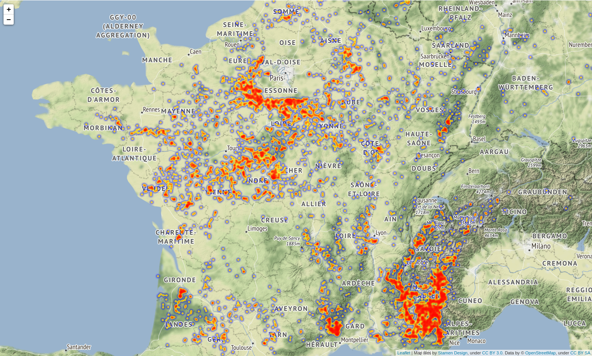

# Gliding Dataset

This binder contains an open dataset with over 100k gliding flights and more
than 6 million gliding phases, along with sample notebooks to better
understand its data.

Launch it via the badge above.

An alternative version is available on
[kaggle](https://www.kaggle.com/rochaporto/gliding-data-starter/notebook).

## Contributing

If you come up with nice visualizations or data analysis that you would like to
share please do so opening pull requests.

